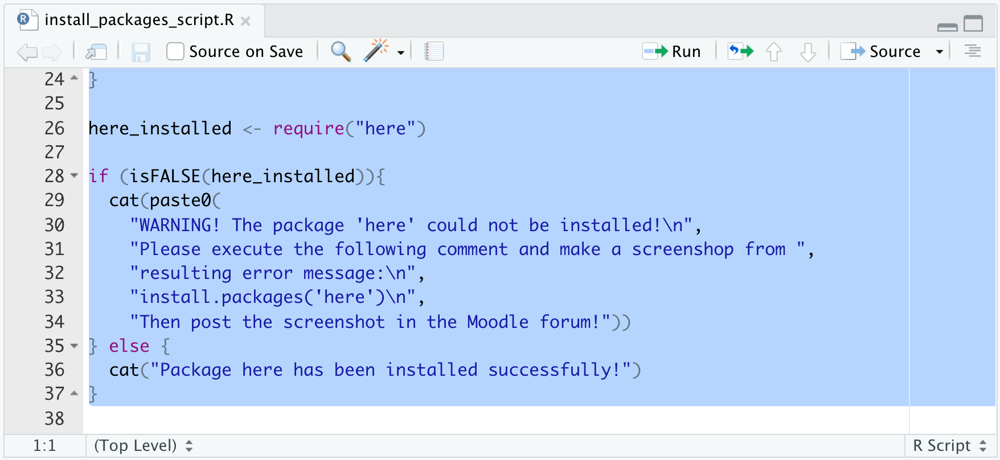
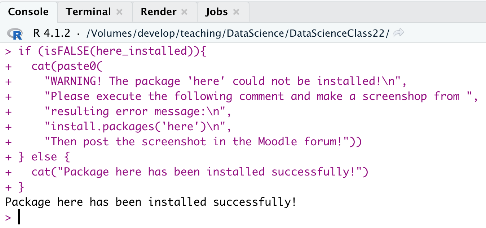
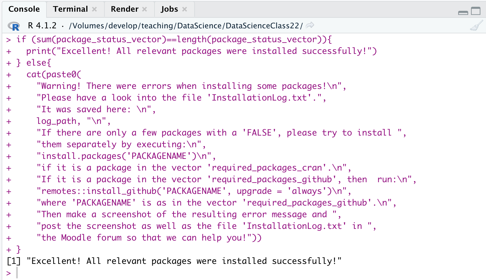

# Installing R packages

After installing [R and R-Studio](/post/installation/), you 
still need to install a number of so called [R packages](https://r-pkgs.org/).
We will learn more about what packages are and how to use them, but I strongly
recommend you to install now already all the packages you will need over the
following semester. This way you make sure that everything is working now, 
and you save yourself from trouble during the semester. Moreover, installing 
these packages is necessary to do the exercises provided after each session.

To install packages, a stable internet connection is required. Then, proceed
as follows:

1. Download the script 
[install_packages_script.R](install_packages_script.R) and save it in a 
directory of your choice
2. Open the file `install_packages_script.R` in R-Studio.
3. Adjust the first to the OS you are using.
For instance, when you are using a Mac the file
should look like this:
<!-- -->
<!-- -->
4. Select lines 1-37 and click on the button `Run` (the screenshot only shows
the lines 24-37, the previous lines are also selected):
<!-- -->
5. Check if the package `here` was installed. You will get the respective 
message in the console:
<!-- -->
If you encounter any problems, please 
make a screenshot and post it in the Moodle forum.
6. Select the rest of the scrip and run it as you did with the first lines.
If you get the following message everything worked well and all packages
were installed successfully:
<!-- -->
If not, please post the file `InstallationLog.txt` and a screenshot with an 
error into the Moodle forum.

Note: maybe you will see the following message during the installation process
(possible multiple times):

<!-- -->

I recommend to type `no` and press enter. If, for any reason, the installation
process is not successful you might run the installation commands again and 
try responding with `Yes`, this might sometimes fix the problem.

# Verify the usability of exercises

If everything worked well until here you should be able to access the 
exercise sheets that I provide you with after each session. To make sure 
everything works as expected, please run the following command in the console
and press enter:


```r
learnr::run_tutorial(
  name = "Basics", 
  package = "DataScienceExercises", 
  shiny_args=list("launch.browser"=TRUE))
```

This means you type it like this and press enter:

<!-- -->

If the exercise window opens, everything is well, if not, please describe your
problem in the Moodle forum.

After you closed the window and the process is still active, just click on the
`Stop` button in R-Studio:

<!-- -->

And then click on the `Console` tab on the left to return to the console.

# Installing LaTeX

To create PDF-documents you have to install a 
[Latex distribution](https://www.latex-project.org/).
I recommend you to install the distribution
[tinytex](https://yihui.org/tinytex/),
irrespectively of whether you already have a different distribution or not.

In the previous step you already installed the *package* `tinytex`.
This is *not* the distribution. To install the latter, you need to execute the
following commands while having a stable internet connection:


```r
tinytex::install_tinytex()
```

Please note that this make take a while and that about 65MB will be downloaded.

To make sure everything runs smoothly you should download the docuument 
`test.Rmd` - it is actually in the ZIP-archive you have downloaded above.
To test whether everything works, please open `test.Rmd` in R-Studio and then
click on the button `Knit to PDF`:


If this works you are all set. If there are any errors showing up, please
post a screenshot and a problem description to the Moodle forum.


## A common problem when installing tinytex on a Mac

The following hints should be helpful if after the attempted installation
of `tinytex` you see either one of these error messages:


In this case, execute the following comment in your R console within
R-Studio:


```r
tinytex::install_tinytex(force = TRUE)
```

Then close R-Studio and restart your computer. If `test.Rmd` still cannot be
compiled after this, please open your Mac Terminal (via the app `Terminal`)
and enter the following commands:

```
sudo chown -R `whoami`:admin /usr/local/bin

~/Library/TinyTeX/bin/x86_64-darwin/tlmgr path add
```
Then install `tinytex` again as described above, restart your computer, and
try to compile `test.Rmd` again.


